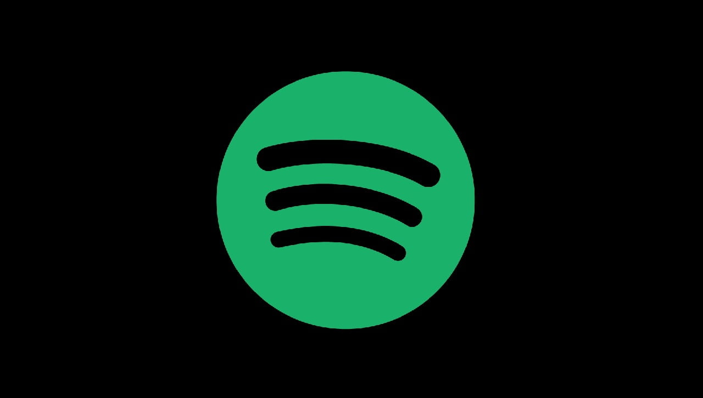

# Test1

## Team
1. Marek Sopel, Github: Soafiel, Zadania: 1,6
2. Joanna Strześniewska, Github: joannas06, Zadania: 2,3
3. Izabela Szwedowska, Github: iziakiziaa, Zadania: 4,5

### Wprowadzenie
Platformy streamingowe to serwisy VOD (wideo na życzenie), które oferują dostęp do filmów, seriali, programów i innych treści wideo przez internet, eliminując potrzebę tradycyjnej telewizji. W Polsce do najpopularniejszych należą Netflix, Max (dawniej HBO Max), Disney+, Amazon Prime Video i Apple TV+, ale istnieją także polskie platformy, takie jak Player, Polsat Box Go czy Canal+ Online  

Popularne platformy streamingowe w Polsce
Netflix: Uważany za lidera rynku w Polsce, oferuje ogromną bibliotekę filmów i seriali. 
Max (dawniej HBO Max): Znany z wysokiej jakości produkcji filmowych i serialowych, często wymieniany jako jedna z najpopularniejszych platform obok Netflixa. 
Disney+: Platforma z treściami od Disney, Pixar, Marvel, Star Wars, National Geographic oraz Star. 
Amazon Prime Video: Oferuje szeroki wybór filmów, seriali i produkcji oryginalnych, dostępnych w ramach subskrypcji Amazon Prime. 
Apple TV+: Platforma z oryginalnymi produkcjami Apple, często chwalona za wysoką jakość, chociaż z mniejszą liczbą treści w porównaniu do konkurencji. 
SkyShowtime: Platforma, która łączy treści od Paramount+ i früheren Universal Studio. 
Viaplay: Platforma znana z transmisji wydarzeń sportowych na żywo oraz produkcji serialowych i filmowych.  

Polskie platformy streamingowe
Player.pl: Oferuje programy i seriale TVN, a także inne treści na życzenie. 
Polsat Box Go: Zapewnia dostęp do produkcji Polsatu, polskich seriali i filmów, a także do pakietów sportowych. 
Canal+ Online: Oferuje dostęp do treści Canal+ i szerokiego wyboru filmów i seriali. 
TVP VOD: Platforma oferująca treści Telewizji Polskiej.  

### Dane
Tabela przedstawiona poniżej zawiera powszechne i latwo dostepne informacje na  temat roznych platform streamingowych. 

| Platforma | Treść | Użytkownicy | Czy Jest Płatne |
|-----------|-------|-------------|-----------------|
| Netflix   | Filmy | 300 mln     | Tak             |
| Spotify   | Audio | 696 mln     | Nie             |
| Tiktok    | Rolki | 1,5 mld     | Nie             |

### Obrazy  

